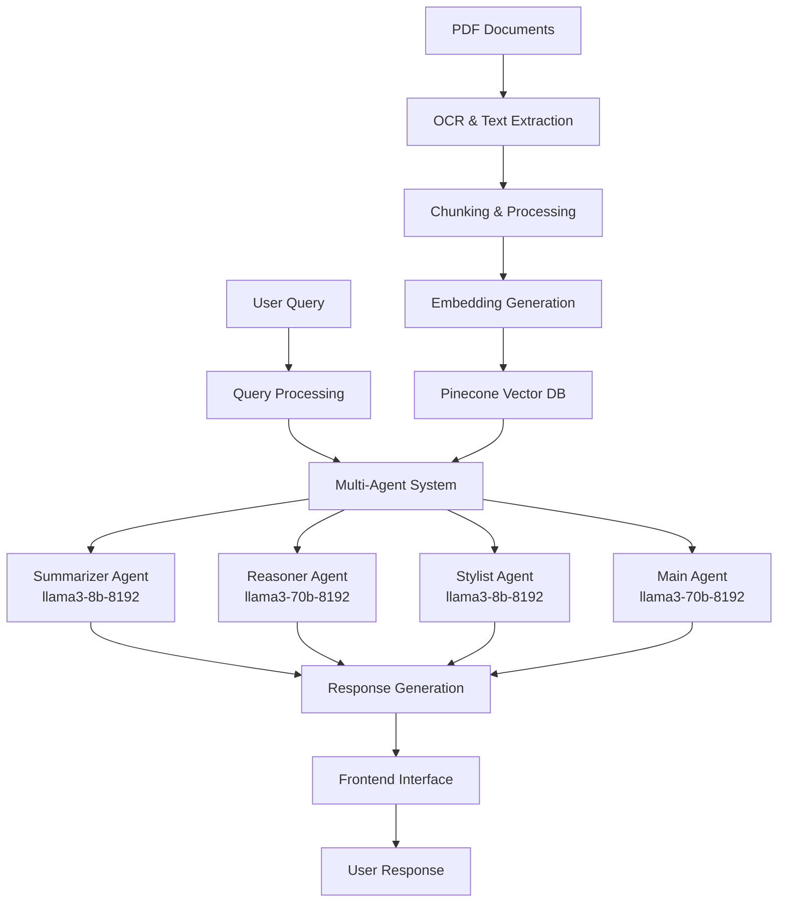

# GenAI-Powered Agentic AI System for Drug Information

[](https://opensource.org/licenses/MIT)
[](https://www.python.org/downloads/)
[](https://reactjs.org/)

> **Revolutionizing drug information accessibility through intelligent AI agents and advanced RAG systems**

---

## 🎯 Problem Statement

Healthcare professionals, patients, and caregivers face significant challenges in accessing accurate drug information:

- **⏰ Time-consuming searches** through partially structured PDF documents
- **📄 Complex data extraction** from drug monographs and prescribing information
- **🔍 Difficulty finding relevant information** with proper citations
- **💬 Lack of interactive, context-aware assistance**

## 🚀 Our Solution

Our **GenAI-Powered Agentic AI System** leverages cutting-edge technology to transform how users interact with drug information:

### 🎯 Core Capabilities
1. **📊 Accurate PDF Interpretation** - Advanced OCR and NER for structured data extraction
2. **🧠 Intelligent Query Understanding** - Context-aware retrieval using RAG
3. **💡 Clear Response Generation** - Interpretable answers with proper citations
4. **🔄 Session-Based Interactions** - Continuous chat with memory management

### ✨ Unique Features

<details>
<summary><strong>🔊 Interactive Text-to-Speech</strong></summary>
Converts responses into speech for enhanced accessibility and hands-free operation.
</details>

<details>
<summary><strong>🎨 Avatar & 3D Interactive UI</strong></summary>
Engaging user interface with 3D models for better user interaction and experience.
</details>

<details>
<summary><strong>👤 Profile Management</strong></summary>
Personalized experience with user-specific profiles and interaction history.
</details>

<details>
<summary><strong>🌐 Global Search via Agentic AI</strong></summary>
Broader search capabilities across connected knowledge bases and external sources.
</details>

---

## 🖼️ User Interface

### Main Dashboard

*Interactive 3D interface with avatar assistant and search capabilities*

### Chat Interface

*Real-time conversation with context-aware responses *

---

## 🏗️ Architecture Overview



## 🛠️ Technology Stack

### Backend Infrastructure
| Component | Technology | Purpose |
|-----------|------------|---------|
| **OCR** | Tesseract OCR | Converting PDFs with images to text |
| **NER** | Custom NER Models | Extract drug names, dosages, parameters |
| **Vector DB** | Pinecone | Vector storage & similarity search |
| **Auth** | Firebase | Authentication & session management |
| **Agent Framework** | LangChain | Agent logic & tool chaining |

### AI/ML Models
| Role | Model | Specifications |
|------|-------|---------------|
| **Chunking** | Deepseek 7B | Document processing |
| **Embeddings** | AllMini LM | Vector generation |
| **Summarizer** | llama3-8b-8192 | Content summarization |
| **Reasoner** | llama3-70b-8192 | Complex reasoning |
| **Stylist** | llama3-8b-8192 | Response formatting |
| **Main Agent** | llama3-70b-8192 | Decision making |
| **Evaluation** | Ragas | RAG system metrics |

### Frontend
- **React** - Interactive web interface
- **CSS** - Styling and animations  
- **Spline** - 3D model integration

---

## 📊 Data Sources

### Primary Dataset
- **Rinvoq** - [FDA Prescribing Information](https://www.rxabbvie.com/pdf/rinvoq_pi.pdf)
- **Humira** - Drug label descriptions
- **Skyrizi** - Comprehensive drug monographs

### Additional Sources
- 🌐 **drugs.com** - Comprehensive drug database
- 🏛️ **Drugs@FDA** - Official FDA drug information
- 📋 **DailyMed** - Current medication information
- 🇪🇺 **EMA** - European Medicines Agency
- 🏢 **Bayer.com** - Pharmaceutical company data
- 🏥 **NHS** - UK National Health Service

---

## 🤖 Why Agentic AI?

### Beyond Static RAG
Instead of simple chunk retrieval, our system **reasons, decides, and acts** by choosing appropriate tools in real-time.

### Personalized & Contextual
With advanced memory buffers and session management, delivers **continuous, tailored conversations** rather than isolated responses.

### Multi-Source Intelligence
Blends knowledge from PDFs, vector databases, web search, and research databases to become a **true problem-solving assistant**.

---

## 🚀 Quick Start

### Prerequisites
```bash
Python 3.8+
Node.js 16+
Firebase Account
Pinecone API Key
Groq API Key
```

### Installation

1. **Clone the repository**
```bash
git clone https://github.com/yourusername/drug-info-ai.git
```

2. **Backend Setup**
```bash
Run in Collab or Kaggle 
```

3. **Frontend Setup**
```bash
cd Cognizant_Project_2025
pip install -r requirements.txt
npm install
npm run dev
```

4. **Environment Configuration**
```bash
cp .env.example .env
# Fill in your API keys and configuration
```

### Configuration
```env
PINECONE_API_KEY=your_pinecone_key
GROQ_API_KEY=your_groq_key
FIREBASE_CONFIG=your_firebase_config
```

---


## 🤝 Contributing

We welcome contributions! Please see our [Contributing Guidelines](CONTRIBUTING.md) for details.

### Development Workflow
1. Fork the repository
2. Create your feature branch (`git checkout -b feature/AmazingFeature`)
3. Commit your changes (`git commit -m 'Add some AmazingFeature'`)
4. Push to the branch (`git push origin feature/AmazingFeature`)
5. Open a Pull Request

---

## Working Demo 

**Video Link:** [https://](https://)

---
## 👥 Team

| Team Members      |
|----------------|
| **Aravindh M**    |
| **Mithun Raaj S** |
| **Prasenna**      |
| **Revanth JR**    |
| **Sasidharan A**  |


---

## 📄 License

This project is licensed under the MIT License - see the [LICENSE](LICENSE) file for details.

---


## 🙏 Acknowledgments

- Thanks to all healthcare professionals who provided feedback
- Open source community for amazing tools and libraries
- Research papers that inspired our approach

---

<div align="center">
  <strong>🌟 Star this repository if you find it helpful! 🌟</strong>
  <br><br>
  Made with ❤️ by the Team Confluence 
</div>
